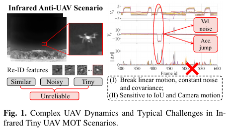
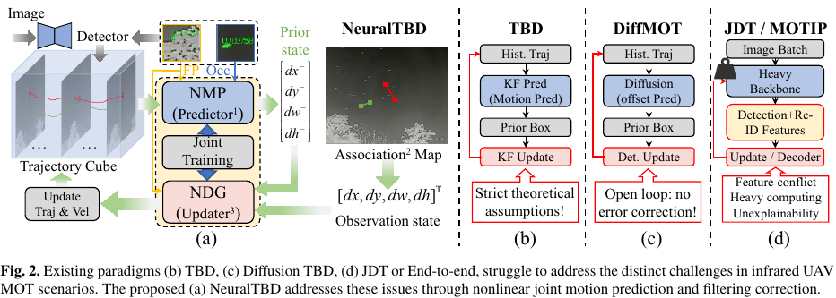
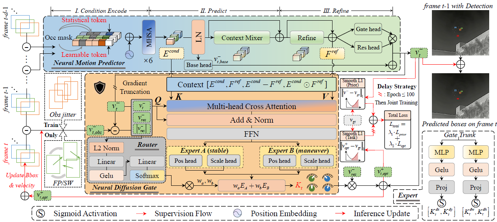

# *<center>Joint Neural Kinematic Prior and Adaptive Filtering for Tiny UAV Multi-object Tracking</center>*

This repository contains the algorithm done in the work Joint Neural Kinematic Prior and Adaptive Filtering for Tiny UAV Multi-object Tracking by Chuiyi Deng et al.

**News**:We will release the complete code after the paper is accepted.

## Visualization effect


## Motivation


## Structure


## Results


## Dataset
Track3 in the 4th Anti-UAV Competition [Download](https://anti-uav.github.io/). You may need to register in order to download the complete training and testing sets. 

Since we didn't have the permission to access the test set of the competition, we re-divided the 200 videos in the training set into a 7:3 ratio. Among them, 140 videos were used as the training set and 60 videos as the test set.

raw video Dataset and labels:
~~~
Dataset/
   ├── TrainVideos/
   │       ├── MultiUAV-001.mp4
   │       └── ....
   │
   └── TrainLabels/
           ├── MultiUAV-001.txt
           └── ....
~~~
The annotation format for each video is as follows:

    frame ID, object ID, x1, y1, w, h, confidence=1, class=1, visibility ratio=1.0]

**Weights**: 

[Weight](./experiments/NeuralTBD/MultiUAV_280_best.pth) for Anti-UAV Track3

To facilitate readers' frame-by-frame training, we have uploaded the processed dataset images, test set division, and the complete Detection txt to Baidu Netdisk. They will be made publicly available for download after the paper is accepted.

## Requirements
Our codebase is built upon **Python 3.10, PyTorch 2.4.0+cu121 (recommended)**. 

:warning: As far as I know, due to the use of some new language features in our code, Python version 3.10 or higher is required. For PyTorch, because there have been changes in the type requirements for attention masks, PyTorch version 2.0 or higher is needed.

### Setup scripts

```shell
conda create -n NeuralTBD python=3.10		# suggest to use virtual envs
conda activate NeuralTBD
# PyTorch:
conda install cuda-toolkit=12.1 -c nvidia -y
pip install torch==2.4.0 torchvision==0.19.0 torchaudio==2.4.0 --index-url https://download.pytorch.org/whl/cu121
# Other dependencies:
conda install pyyaml tqdm matplotlib scipy pandas
pip install wandb accelerate einops
```

## Commands for Training
For YOLO training and tool preparation, please refer to the [website](https://codalab.lisn.upsaclay.fr/competitions/21806#learn_the_details-get_starting_kit).
```
cd ./configs/multiuav.yaml
Modify eval_mode: False
python main.py ---config './configs/multiuav.yaml'
```
* Checkpoints and Logs will be saved to `./experiments/{eval_expname}/`.

## Commands for Testing
During the test, we used the YOLOv5 training weights provided by the competition organizers, and the detection txt files were stored in the xyxy format.
```
cd ./configs/multiuav.yaml
Modify eval_mode: True
python main.py ---config './configs/multiuav.yaml'
```
* Network preditions and metrics will be saved to `./experiments/output/`.

## Acknowledge
*This code is highly borrowed from [DIffMOT](https://github.com/Kroery/DiffMOT). Thanks to Lv, Weiyi.


